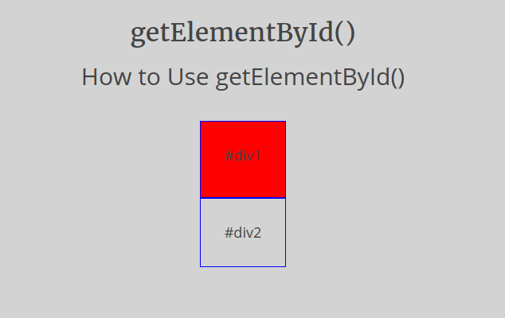
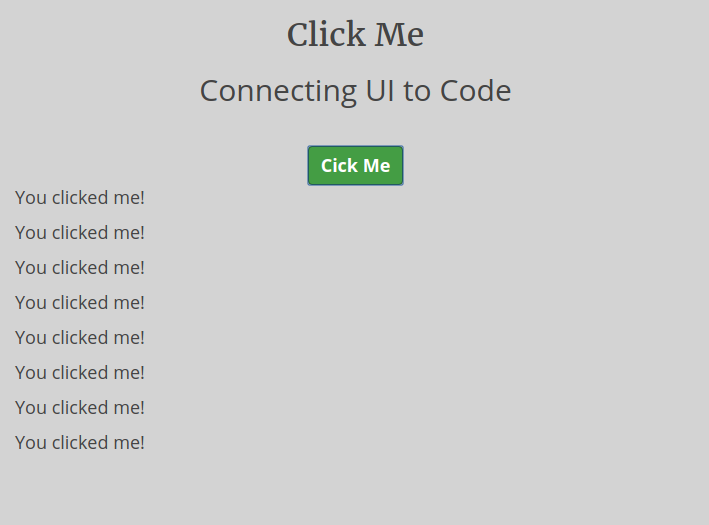
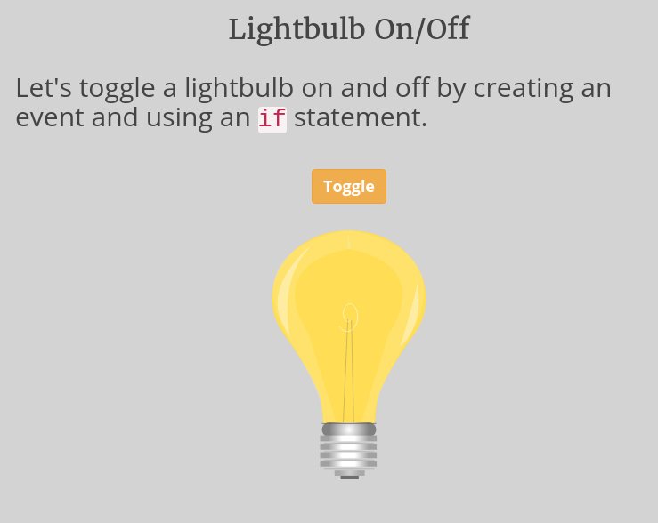
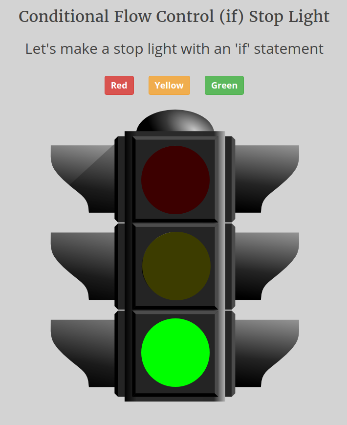
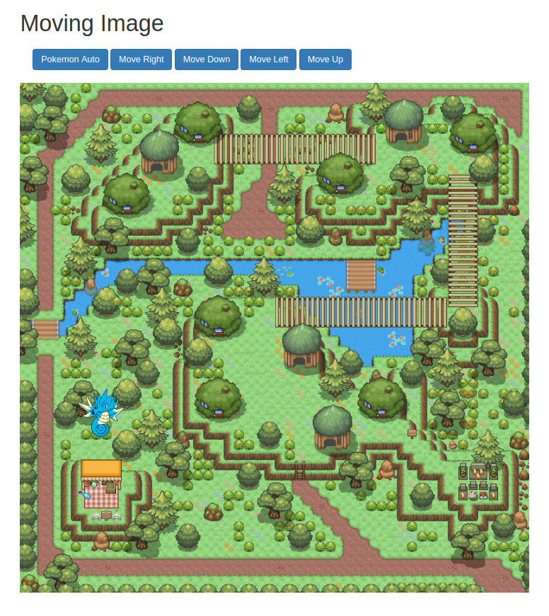

# Intro to JavaScript Part II

A teacher-led visually oriented introduction to JavaScript targeted toward 11 to 14 year olds.

**Status: evolving**

*Where is Part I?*
*Part I will be editor and project setup. It has not been written yet*

## Prerequisites
You only need to know the very basics of the following
- CSS
- HTML
- Variables
- Assignment
- Functions
- console.log()

## Project 1 - ````getElementById()````
Learn to use ````getElementById()```` to color a ````<div>````



## Project 2 - Click Me
Learn to attach an event listener to a HTML element



## Project 3 - Light On/Off
Learn to turn a light on and off using an ````if```` and ````else````.



## Project 4 - Stop Light
Learn to automate a stop light using ````if````, ````else if```` and ````else````.



## Moving Image
Learn to move a Pokemon around a map using the following constructs, methods & concepts
### CSS
- class selector
### JS
- keydown event
- ````switch {}````
- ````clsssList.add()````
- ````classList.remove()````
- ````window.addEventListener()````
- ````+=````
- ````-=````
- string concatenation
### Concepts
- left
- top  


